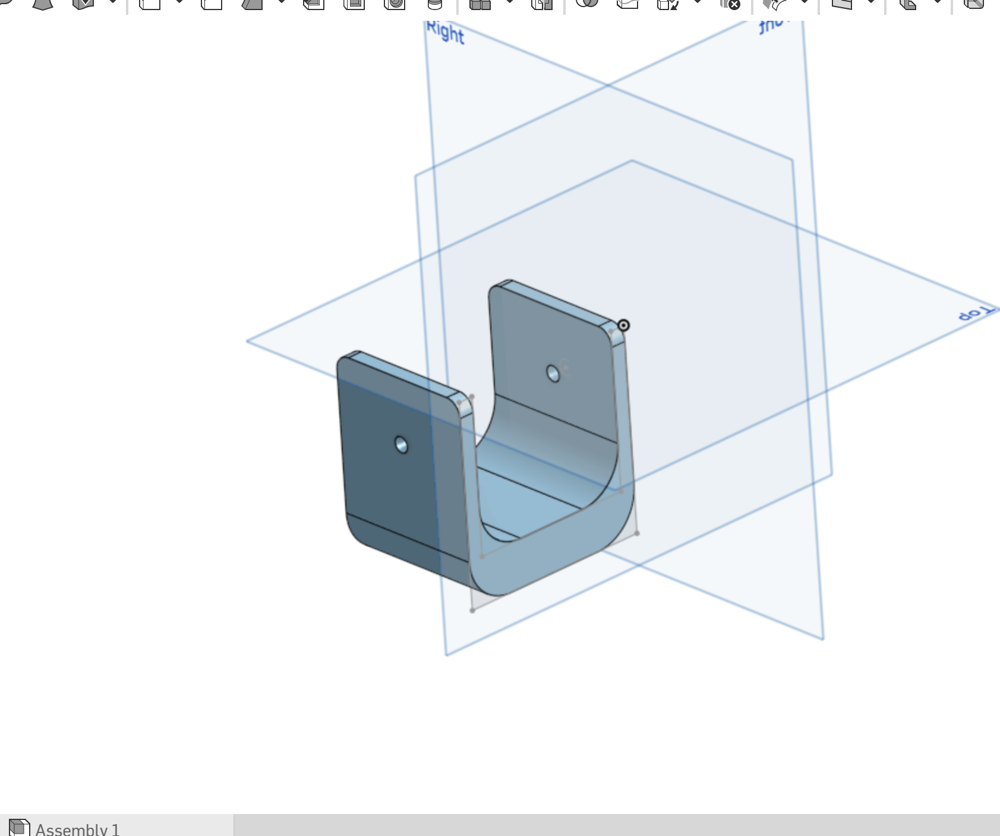

# Robotic Arm Joint Design – Enhanced Version

This project presents an improved joint design for a robotic arm, modeled using Onshape. The goal was to enhance the structural strength of the joint while maintaining the original dimensional constraints.

## Objective
Redesign the robotic arm joint to:
- Improve structural integrity and strength
- Maintain the original dimensions provided
- Prepare the model for FEA simulation and comparison

## Key Features
- Optimized geometry for better force distribution
- Clean and organized feature tree
- Ready for presentation and simulation testing

## Model Preview

 

## View the Model on Onshape

[Click here to view the full model in Onshape](https://cad.onshape.com/documents/fc7bd6ffb1d77d6bf81e8faa/w/2c0bcf47e86fc242b28354fc/e/986a720e9afaf76240b05ca1?configuration=List_ZKvtsxCuPpYWiW%3DDefault&renderMode=0&uiState=6887e5fba62ef20fe4216160)
